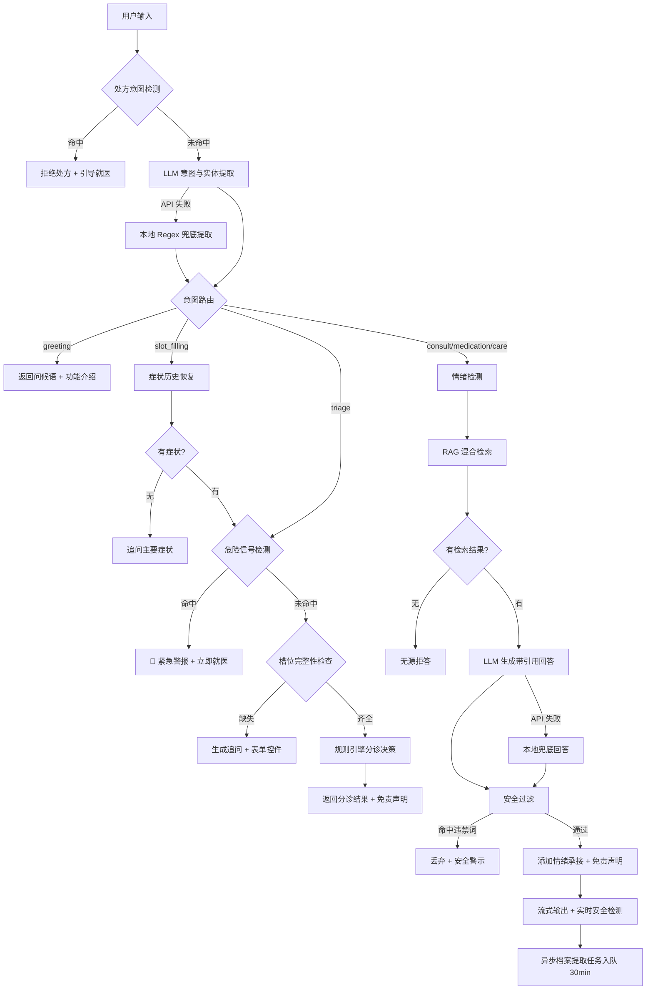

# 智能儿科分诊与护理助手 — 需求文档 (PRD)

> **版本**: v4.1 (基于代码审计同步)
> **更新日期**: 2026-02-14
> **文档性质**: Source of Truth — 与代码实现完全对齐

---

## 一、项目背景与业务目标

### 1.1 项目背景

- **线下就医的顾虑**：三甲医院儿科常年超负荷运转，交叉感染风险让家长对轻症就医望而却步；社区基层医疗缺乏儿科专业能力。
- **生活类社区的决策困境**：海量碎片化内容让用户陷入筛选疲劳；泛滥的商业软广与缺乏科学支撑的个体经验，让新手父母面临极高的信任成本。
- **线上付费问诊的信任赤字**：真人医生在线上无法触诊/听诊，往往给出保守、宽泛的建议。按次付费无法覆盖高频琐碎的日常询问。
- **"夜间真空期"的决策瘫痪**：婴幼儿突发状况常发于夜间，新手父母急需一个即时响应、7×24 在线、能给出明确行动指引的智能助手。

### 1.2 定位与核心价值

- **产品定位**：连接家庭与医疗系统的"智能分诊助手"
- **核心价值**：
  - **及时安抚**：缓解新手父母在深夜求医时的恐慌情绪，提供全天候陪伴
  - **科学分诊**：基于急诊指南构建的规则引擎，将模糊症状映射为确定性的三级指令
  - **权威知识**：过滤掉社区中的软广与伪科学，提供唯一可信源的标准化护理建议

### 1.3 技术架构选型

- **护栏优先的混合架构**：用大模型的理解能力识别用户意图、提取症状实体；基于权威指南硬编码的规则引擎确保每一条建议有据可查，兜底医疗安全。
- **双重降级保障**：当远程 LLM API 不可用时，系统自动降级为本地 Regex 规则引擎，确保核心分诊功能不中断。

### 1.4 核心业务目标与衡量指标

**北极星指标**：有效分诊闭环率 > 80%（用户在单次会话中获得明确行动指令并停止焦虑性重复搜索的比例）

**风控指标**：

| 维度 | 指标名称 | 目标值 | 业务含义 |
|------|---------|--------|---------|
| 安全风控 | 急症召回率 | 100% | 所有高危症状必须 100% 识别并触发报警 |
| 内容质量 | 防幻觉准确率 | 99.9% | 每条护理建议必须溯源到权威指南 |
| 用户体验 | 首问解决率 | > 70% | AI 在第一轮对话中精准捕捉意图并回答 |
| 系统性能 | 首字延迟 | < 1.5s | 流式输出必须在 1.5 秒内给用户反馈 |

### 1.5 用户画像及核心场景

**用户画像**：25-35 岁、孩子 0-3 岁（尤其 6 个月内）的新手父母，高度依赖在线工具，对风险极度敏感，渴望获得明确指令性建议。

**核心场景**：

| 场景 | 主诉 | 输出 |
|------|------|------|
| 高热 | 宝宝半夜发烧到39度，精神有点蔫 | 立即就医指令 |
| 用药 | 美林和泰诺林能一起吃吗？ | 基于药典的准确间隔时间 + 禁忌症警告 |
| 功能性问题 | 宝宝便秘吃西梅泥有用吗？ | 饮食调整建议 + 原理解释 |
| 新手知识 | 辅食第一口吃什么？ | 标准辅食添加时间表 |

---

## 二、系统架构

### 2.1 技术架构总览

```
┌─────────────────────────────────────────────────────────────┐
│                     Frontend (Vanilla JS)                     │
│  index.html + app.js + components.js + styles.css            │
│  ┌──────────┐ ┌──────────┐ ┌──────────┐ ┌──────────────┐   │
│  │ Chat UI  │ │ Health   │ │Disclaimer│ │ Conversation │   │
│  │ (Stream) │ │Dashboard │ │  Modal   │ │   Sidebar    │   │
│  └──────────┘ └──────────┘ └──────────┘ └──────────────┘   │
└──────────────────────┬──────────────────────────────────────┘
                       │ HTTP / SSE
┌──────────────────────▼──────────────────────────────────────┐
│                  Backend (FastAPI + Uvicorn)                  │
│                                                              │
│  ┌─────────────────────────────────────────────────────┐    │
│  │              Performance Middleware                   │    │
│  │         (P50/P90/P95/P99, X-Response-Time)          │    │
│  └─────────────────────────────────────────────────────┘    │
│                                                              │
│  ┌──────────────┐    ┌──────────────┐                       │
│  │ Chat Router  │    │Profile Router│                       │
│  │  /api/v1/chat│    │/api/v1/profile│                      │
│  └──────┬───────┘    └──────┬───────┘                       │
│         │                   │                                │
│  ┌──────▼───────────────────▼──────────────────────────┐    │
│  │                  Service Layer                       │    │
│  │  ┌────────────┐ ┌────────────┐ ┌──────────────┐    │    │
│  │  │LLM Service │ │RAG Service │ │Triage Engine │    │    │
│  │  │(DeepSeek)  │ │(Hybrid)    │ │(Rule-based)  │    │    │
│  │  └────────────┘ └────────────┘ └──────────────┘    │    │
│  │  ┌────────────┐ ┌────────────┐ ┌──────────────┐    │    │
│  │  │Safety      │ │Stream      │ │Profile       │    │    │
│  │  │Filter      │ │Filter      │ │Service       │    │    │
│  │  └────────────┘ └────────────┘ └──────────────┘    │    │
│  │  ┌────────────┐ ┌────────────┐ ┌──────────────┐    │    │
│  │  │Conversation│ │Member      │ │Health History │    │    │
│  │  │Service     │ │Profile Svc │ │Service       │    │    │
│  │  └────────────┘ └────────────┘ └──────────────┘    │    │
│  └─────────────────────────────────────────────────────┘    │
│                                                              │
│  ┌─────────────────────────────────────────────────────┐    │
│  │                  Data Layer (SQLite)                  │    │
│  │  profiles | conversations | members | vital_signs    │    │
│  │  health_habits | allergy_history | medical_history   │    │
│  │  family_history | medication_history | task_queue     │    │
│  │  consultation_records | prescription_records | ...   │    │
│  └─────────────────────────────────────────────────────┘    │
│                                                              │
│  ┌─────────────────────────────────────────────────────┐    │
│  │              Knowledge Base (JSON Files)              │    │
│  │  fever.json | cough.json | diarrhea.json | rash.json │    │
│  │  vomit.json | fall.json | medication.json | 便秘.json │    │
│  └─────────────────────────────────────────────────────┘    │
│                                                              │
│  ┌─────────────────────────────────────────────────────┐    │
│  │           Triage Rules (JSON Config)                  │    │
│  │  danger_signals.json | fever_rules.json              │    │
│  │  slot_definitions.json                                │    │
│  └─────────────────────────────────────────────────────┘    │
└──────────────────────────────────────────────────────────────┘
         │                              │
         ▼                              ▼
┌──────────────────┐          ┌──────────────────┐
│  DeepSeek API    │          │  SiliconFlow API │
│  (deepseek-chat) │          │  (BAAI/bge-m3)   │
│  意图提取/RAG生成 │          │  文本向量化       │
└──────────────────┘          └──────────────────┘
```

### 2.2 核心数据流 (Mermaid)



## 三、核心功能详细说明

### 3.1 智能分诊

#### 3.1.1 意图识别（LLM + 本地兜底双层架构）

**LLM 意图提取**（主路径）：
- 模型：DeepSeek (`deepseek-chat`)，Temperature = **0.1**
- 意图类型：`triage` | `consult` | `medication` | `care` | `greeting` | `slot_filling`
- 提取实体：symptom, temperature, duration, mental_state, age_months, accompanying_symptoms, fall_height, frequency, cough_type, rash_location, rash_appearance, stool_character, cry_pattern

**本地 Regex 兜底**（降级路径）：
- 触发条件：LLM API 不可用（含 60 秒冷却期内）
- Greeting 检测：完全匹配短文本（"你好"、"谢谢"等），排除含医疗关键词的混合意图
- Slot-filling 检测：匹配 `key: value` 格式输入
- 症状提取：基于关键词列表匹配（发烧、摔倒、呕吐、腹泻、咳嗽、皮疹、哭闹、惊厥、便秘等）
- 实体提取：正则匹配月龄（`\d+个月`）、体温（`\d+度`）、持续时长（`\d+小时/天`）、精神状态关键词

**症状同义词归一化**：

| 口语表达 | 标准术语 |
|---------|---------|
| 发热、高热、高烧 | 发烧 |
| 摔伤、跌落、跌倒 | 摔倒 |
| 拉肚子、拉稀 | 腹泻 |
| 吐奶 | 呕吐 |
| 起疹子、湿疹 | 皮疹 |

**实体后处理纠错**：LLM 提取结果经过二次校验，修复常见误判（如文本含"摔"但症状被误提取为"呕吐"时自动纠正为"摔倒"），并补全伴随症状（"呕吐"、"带血"等）。

#### 3.1.2 危险信号熔断机制

**通用危险信号**（任何症状均触发）：

| 信号 | 关键词 | 动作 |
|------|--------|------|
| 惊厥/抽搐 | 惊厥、抽搐、抽风 | 立即拨打 120 |
| 呼吸困难 | 呼吸困难、口唇发紫、喘不过气 | 立即拨打 120 |
| 意识障碍 | 昏迷、昏睡、难以唤醒 | 立即拨打 120 |

**症状特定危险信号**（基于 JSON 规则配置）：

| 症状 | 条件 | 动作 |
|------|------|------|
| 发烧 | 月龄 < 3 个月 | 立即就医（低龄高热高危） |
| 发烧 | 体温 ≥ 39℃ + 精神萎靡 | 尽快就医 |
| 发烧 | 持续 ≥ 48 小时 | 就医检查 |
| 摔倒 | 伴随昏迷或呕吐 | 立即急诊（疑似颅脑损伤） |

#### 3.1.3 智能追问与槽位补全

**槽位定义**（按症状配置）：

| 症状 | 必填槽位 | 选填槽位 |
|------|---------|---------|
| 发烧 | age_months, temperature, duration, mental_state | accompanying_symptoms |
| 摔倒 | age_months, mental_state | accompanying_symptoms |
| 呕吐 | age_months, duration, mental_state | accompanying_symptoms |
| 腹泻 | age_months, duration | accompanying_symptoms |

**档案自动填充**：系统优先从用户健康档案读取 age_months 和 weight_kg，避免重复追问。

**轻症追问放松**：发烧场景下，若月龄 ≥ 3 且体温 < 38.5℃ 且精神状态正常，跳过追问直接给出居家观察建议。

**结构化表单控件**：流式接口返回 slot 定义（type/label/options/min/max/step），前端据此渲染：
- `number`：月龄（0-216）、体温（35.0-42.0，步长 0.1）
- `select`：精神状态（5 选项）、坠落高度（5 选项）、大便性状（5 选项）等
- `multiselect`：伴随症状（7 选项）

**症状历史恢复**：当 slot_filling 意图缺少 symptom 时，系统自动回溯最近 10 条对话历史，用 Regex 提取上一轮的症状实体。

#### 3.1.4 分诊决策引擎

采用 **JSON 规则引擎 + 硬编码兜底** 双层架构：
1. 优先匹配 `triage_rules/*.json` 中的条件规则（按 priority 排序）
2. 未匹配时回退到硬编码逻辑（发烧、摔倒、呕吐、腹泻）
3. 均未匹配时返回默认"居家观察"建议

**中文数字解析**：支持"三个月"、"十二个月"等中文数字输入。

**持续时长转换**：自动将"2天"→48h、"3小时"→3h、"30分钟"→0.5h。

---

### 3.2 循证问答 + 内容溯源

#### 3.2.1 知识库

**白名单知识库**（12 个 JSON 文件，中英双语）：
- 症状类：fever.json / 发烧.json、cough.json、diarrhea.json / 腹泻.json、vomit.json、rash.json / 湿疹.json、fall.json / 摔倒.json、便秘.json
- 用药类：medication.json
- 来源：《默沙东诊疗手册（家庭版）》、《美国儿科学会 (AAP) 育儿百科》

每条 entry 包含：id, title, content, source, tags, age_range, alert_level, category

#### 3.2.2 检索策略（混合检索 + 启发式重排序）

**Step 1: 混合检索召回 (Top-50)**
- 语义检索 (70% 权重)：SiliconFlow Embedding API (BAAI/bge-m3) + 余弦相似度
- 关键词检索 (30% 权重)：自定义医学术语分词器 + 词频余弦相似度
- 同义词扩展：口语化表达 ↔ 标准术语双向映射
- 标题匹配加权 +0.5，标签匹配加权 +0.2
- 年龄过滤：基于用户档案中的 age_months 预过滤

**Step 2: 启发式重排序 (Top-3)**
- 精确短语匹配奖励 +0.2
- 医学实体匹配奖励 +0.3（如"泰诺林"、"美林"）
- 同义词/口语化匹配奖励 +0.2
- 阈值过滤：远程模式 score < **0.3** 丢弃，本地模式 score < **0.1** 丢弃

**降级策略**：
- 远程 API 不可用时，自动切换为纯关键词检索（本地阈值 0.2）
- Embedding 缓存：内存级缓存避免重复 API 调用
- 启动时预构建全量文档 token 计数索引

#### 3.2.3 回答生成

**LLM 生成**（主路径）：
- 模型：DeepSeek (`deepseek-chat`)，Temperature = **0.3**
- System Prompt 角色：「小儿安」— 温暖专业的儿科健康顾问
- 输出模板：核心结论 → 护理建议 → 注意事项 → 就医信号 → 引导问题
- 禁止事项：不推荐处方药、不做确诊判断、不给绝对化承诺

**本地兜底回答**（降级路径）：
- 基于 Top-1 检索结果拼接结构化回答
- 包含：核心结论、操作建议、注意事项、就医信号、引导问题

**溯源机制**：
- 来源标记从正文中清理（`format_with_citations` 移除 `【来源:xxx】`）
- 来源元数据通过 API 响应的 `sources` 字段独立返回（id, title, source）
- 前端通过 `/source/{entry_id}` API 获取原文片段

**无源拒答**：当检索结果为空时，返回："抱歉，我的权威知识库中暂无关于此问题的记录。建议您咨询专业医生。"

#### 3.2.4 情绪承接

检测焦虑关键词（"急"、"怎么办"、"哭闹"、"担心"、"害怕"等 10 个），根据症状场景返回差异化安抚话术：
- 哭闹场景："听到宝宝哭闹确实让人很揪心，请先深呼吸，我们一步步来解决。"
- 发烧场景："看到宝宝发烧确实让人担心，别着急，我们先了解一下情况。"
- 通用场景："理解您的担心，这是一个非常好的问题，很多新手爸妈都会遇到。"

#### 3.2.5 引导提问

基于 8 类症状的规则化引导问题生成（每类 3 个高价值后续问题）：
- 发烧 → "什么情况下需要立即去医院？" / "如何正确测量体温？" / "退烧药怎么选择和使用？"
- 腹泻 → "如何预防脱水？" / "什么样的大便需要就医？" / "腹泻期间如何喂养？"
- 通用 → "有哪些需要特别注意的地方？" / "什么情况需要就医？" / "如何观察宝宝的恢复情况？"

### 3.3 安全熔断与违禁词过滤

#### 3.3.1 处方意图拦截（最高优先级）

在所有处理之前，检测用户输入是否包含处方意图关键词：
- 关键词：开药、开处方、给我开、帮我开、抗生素、头孢、阿莫西林、消炎药
- 命中后立即返回拒绝话术 + 引导就医建议

#### 3.3.2 双层黑名单过滤

**List A: 通用红线** (`general_blacklist.txt`)：
- 关键词：炸弹、自杀、毒药、色情、赌博、转账、暴力、恐怖、政治、敏感
- 兜底话术："抱歉，我无法回答该问题。作为一个儿科健康助手，我只专注于解答儿童护理与健康相关的咨询。"

**List B: 医疗红线** (`medical_blacklist.txt`)：
- 禁药类：尼美舒利、安乃近
- 伪科学类：排毒、根治、包治百病、转胎药、偏方
- 高风险操作：酒精擦身、放血、催吐、灌肠
- 合规类：确诊是、我保证、肯定没问题、一定能治好
- 兜底话术："⚠️ 安全警示：基于安全风控原则，该回复已被系统拦截..."

> **设计决策**：阿司匹林、复方感冒药、抗生素等药物名称已从医疗黑名单中移除，因为知识库原文中合理提及这些药物，过滤会导致正常回答被截断。替代方案：在 Prompt 层面约束 LLM 不主动推荐处方药。

#### 3.3.3 流式输出安全熔断

- `StreamSafetyFilter` 维护累积 buffer，每个 chunk 追加后检查全文
- 命中违禁词时：发送 `type="abort"` 信号 → 前端丢弃已输出内容 → 显示安全警示
- 未命中时：正常输出 chunk

#### 3.3.4 免责声明

- **首次进入弹窗**：全屏 Disclaimer Modal，用户必须点击"我已知晓"才能解锁输入框（localStorage 持久化）
- **常驻水印**：每条 AI 回复末尾附带灰色小字 "*AI生成内容仅供参考，不作为医疗诊断依据。请以线下医生医嘱为准。*"（自动去重）
- **输入框占位符**："请描述症状（AI建议仅供参考，急症请直接就医）..."

---

### 3.4 健康档案与长短期记忆

#### 3.4.1 异步档案提取（ETL Pipeline）

**触发机制**：每次 RAG/分诊回复后，创建延迟 30 分钟的提取任务入 SQLite 任务队列。

**任务队列**：
- 存储：SQLite `task_queue` 表（id, task_type, payload, execute_at, status）
- 状态：pending → completed / failed / cancelled
- 轮询：后台 worker 每 60 秒检查到期任务（最多处理 10 个）
- 去重：同一用户同一对话的旧 pending 任务会被取消

**提取流程**：
1. 拉取该 Session 的完整对话记录
2. 合并所有用户消息
3. 调用 LLM 提取 baby_info / allergy_history / medical_history / medication_history
4. 对比现有档案，生成 pending_confirmations

#### 3.4.2 用户确认机制 (Human-in-the-loop)

- 高危字段（过敏、病史）写入 `pending_confirmations`，等待用户下次登录确认
- API：`GET /profile/{user_id}/pending` 获取待确认项
- API：`POST /profile/{user_id}/confirm` 确认或拒绝（支持批量）
- 确认后写入正式档案，拒绝后从 pending 列表移除

#### 3.4.3 运行时上下文注入

用户发起新咨询时，后端自动：
1. 读取 `profiles` 表获取 baby_info / allergy_history / medical_history
2. 注入到 LLM 意图提取的 user_prompt 中
3. 注入到 RAG 生成的 context 中
4. 用于槽位自动填充（age_months, weight_kg）

新增约束（多就诊人成员场景）：
- 会话在首条消息阶段绑定 `member_id`，绑定后为该会话不可变属性
- 后续消息若携带不同 `member_id`，后端返回 `member_mismatch`，前端必须提示“新建会话后再切换就诊人”
- `age_months` 不允许直接持久化用户口述值作为长期档案事实；档案展示与推理均以 `birth_date + 当前日期` 动态换算
- 归档操作必须读取会话已绑定 `member_id`，不以“点击归档瞬间前端当前选中成员”作为唯一真值

#### 3.4.4 家庭成员管理

完整的 CRUD 系统：
- 成员信息：姓名、关系、证件、性别、出生日期、手机、头像
- 体征管理：身高、体重、BMI（自动计算+状态判定）、血压、血糖
- 生活习惯：饮食、运动、睡眠、烟酒、久坐、心理状态
- 数据校验：身高 20-250cm、体重 max 300kg、血糖 0.5-50.0、收缩压>舒张压
- 身份证号一经设置不可修改

#### 3.4.5 健康史管理

四类独立 CRUD：
- 过敏史：过敏原、反应、严重程度（mild/moderate/severe）
- 既往病史：疾病、诊断日期、治疗方式、状态、医院
- 家族病史：疾病、亲属关系
- 用药史：药品、剂量、频率、起止日期、原因

#### 3.4.6 健康记录管理

五类记录：
- 问诊记录、处方记录、挂号记录、病历存档、体检检验记录

---

### 3.5 对话管理

- **多会话支持**：用户可创建、切换、删除多个对话
- **自动标题**：取首条用户消息前 30 字作为对话标题
- **历史记录**：SQLite 存储，支持按 conversation_id 查询（默认限 50 条）
- **线程安全**：所有 SQLite 操作通过 threading.Lock 保护

#### 3.5.1 会话上下文隔离（医疗安全关键约束）

- 成员切换必须触发“新会话”或“清空当前会话历史”二选一，不允许在同一会话继续追问
- 前端保存 `last_active_member_id:<user_id>`，刷新后优先恢复，避免误切回默认成员
- 后端会话数据记录 `member_id`，用于历史查询、归档入库、风险审计
- 会话归档前执行双检验：
  - 主检验：读取会话已绑定 `member_id`
  - 次检验：若前端请求同时携带 `member_id` 且不一致，则返回错误并拒绝归档

---

## 四、系统配置与约束

### 4.1 关键参数表

| 参数 | 值 | 说明 | 配置位置 |
|------|---|------|---------|
| DEEPSEEK_MODEL | `deepseek-chat` | LLM 模型 | config.py |
| EMBEDDING_MODEL | `BAAI/bge-m3` (SiliconFlow) | 向量化模型 | config.py |
| SIMILARITY_THRESHOLD | **0.3** | RAG 相似度阈值 | config.py |
| TOP_K_RETRIEVAL | **3** | RAG 返回文档数 | config.py |
| STREAM_CHUNK_SIZE | **50** 字符 | 流式输出块大小 | config.py |
| FIRST_TOKEN_TIMEOUT | **1.5s** | 首字延迟目标 | config.py |
| MAX_CONVERSATION_HISTORY | **20** 条 | 最大对话历史 | config.py |
| SESSION_TIMEOUT | **1800s** (30min) | 会话超时 | config.py |
| PROFILE_EXTRACT_DELAY | **1800s** (30min) | 档案提取延迟 | config.py |
| RATE_LIMIT_PER_MINUTE | **20** 次 | 每分钟限流 | config.py |
| RATE_LIMIT_PER_DAY | **500** 次 | 每天限流 | config.py |
| 意图提取 Temperature | **0.1** | 低温确保确定性 | llm_service.py |
| RAG 生成 Temperature | **0.3** | 适度创造性 | rag_service.py |
| 流式生成 Temperature | **0.7** | 较高创造性 | llm_service.py |
| API 冷却时间 | **60s** | 失败后降级时长 | llm/rag_service.py |
| 任务轮询间隔 | **60s** | 后台 worker 频率 | profile_service.py |
| 混合检索权重 | **0.7** 语义 + **0.3** 关键词 | 检索融合比例 | rag_service.py |
| 本地检索阈值 | **0.2** | 本地模式最低分 | rag_service.py |
| 慢请求告警 | **>1s** 警告, **>2s** 错误 | 性能监控 | performance.py |

### 4.2 技术栈

| 层级 | 技术 | 版本 |
|------|------|------|
| 后端框架 | FastAPI | 0.115.0 |
| 服务器 | Uvicorn | 0.30.6 |
| 数据校验 | Pydantic | 2.9.2 |
| LLM 客户端 | OpenAI SDK (兼容 DeepSeek) | 1.10.0 |
| 向量化 | SiliconFlow API (BAAI/bge-m3) | - |
| 数据库 | SQLite | 内置 |
| 日志 | Loguru | - |
| 性能统计 | numpy | - |
| 测试 | pytest + pytest-asyncio | - |
| 前端 | Vanilla JavaScript (ES6) | - |
| 样式 | CSS3 + CSS Variables | - |

### 4.3 API 端点清单

**Chat Router** (`/api/v1/chat`):

| 方法 | 路径 | 说明 |
|------|------|------|
| POST | `/send` | 发送消息（非流式） |
| POST | `/stream` | 发送消息（SSE 流式） |
| POST | `/archive` | 归档当前对话到健康档案（按会话绑定成员落库） |
| GET | `/history/{conversation_id}` | 获取对话历史 |
| GET | `/source/{entry_id}` | 获取知识库原文片段 |
| GET | `/conversations/{user_id}` | 获取用户所有对话 |
| DELETE | `/conversations/{user_id}/{conversation_id}` | 删除对话 |
| POST | `/conversations/{user_id}` | 创建新对话 |

**Profile Router** (`/api/v1/profile`):

| 方法 | 路径 | 说明 |
|------|------|------|
| GET | `/{user_id}` | 获取健康档案 |
| PUT | `/{user_id}` | 更新档案 |
| POST | `/{user_id}/confirm` | 确认待确认更新 |
| GET | `/{user_id}/pending` | 获取待确认项 |
| GET | `/{user_id}/members` | 获取家庭成员列表 |
| POST | `/{user_id}/members` | 创建成员 |
| GET | `/members/{member_id}` | 获取成员详情 |
| PUT | `/members/{member_id}` | 更新成员 |
| DELETE | `/members/{member_id}` | 删除成员 |
| PUT | `/members/{member_id}/vital-signs` | 更新体征 |
| PUT | `/members/{member_id}/habits` | 更新生活习惯 |
| GET/POST | 健康史 CRUD | 过敏/病史/家族/用药 |
| GET/POST | 健康记录 CRUD | 问诊/处方/挂号/病历/体检 |

**系统端点**:

| 方法 | 路径 | 说明 |
|------|------|------|
| GET | `/health` | 健康检查 |
| GET | `/metrics/performance` | 性能指标 |

---

## 五、前端功能说明

### 5.1 页面结构

- **Chat Tab**：对话界面（欢迎屏 → 消息列表 → 输入框）
- **Health Tab**：健康档案仪表盘（BMI 卡片 → 指标网格 → 健康记录 → 生活习惯 → 健康史）
- **Conversation Sidebar**：左侧滑出的对话历史列表

### 5.2 核心交互组件

| 组件 | 说明 |
|------|------|
| `createDisclaimerModal` | 首次进入免责声明弹窗 |
| `createDangerSignalModal` | 紧急警报弹窗（触觉反馈 + 焦点陷阱） |
| `createStreamBubble` | 流式消息气泡（闪烁光标动画） |
| `createTriageResultCard` | 分诊结果卡片（红/黄/绿三级） |
| `createSourceSheet` | 底部抽屉式来源查看器 |
| `createSlotTracker` | 槽位收集进度追踪器 |
| `createQuickReplies` | 快捷回复芯片按钮 |
| `createFollowUpForm` | 动态表单（text/number/select/multiselect） |
| `createHealthDashboard` | 健康档案仪表盘 |
| `createMemberProfileForm` | 成员信息编辑表单 |
| `createMemberSelectorModal` | 就诊人切换弹窗（聊天与档案页复用） |

### 5.3 Markdown 渲染

前端 `formatMessage()` 支持：h3 标题、加粗、引用块、有序/无序列表。渲染后的 HTML 通过 CSS 样式美化。

---

## 六、未实现功能（Backlog）

| 功能 | PRD 状态 | 代码状态 | 备注 |
|------|---------|---------|------|
| 话题漂移处理 | 已设计 | **未实现** | Global Router 无漂移检测逻辑 |
| 图文增强（示意图） | P1 规划 | **未实现** | 如海姆立克急救法示意图 |
| 地图导航按钮 | 已设计 | **未实现** | 急症弹窗附带地图导航 |
| ChromaDB 向量数据库 | 已配置 | **未启用** | 目录存在但未在主流程中使用 |
| Redis 缓存 | 已配置 | **未启用** | 配置存在但无实际调用 |
| 限流中间件 | 已配置 | **未实现** | 参数已定义但无中间件代码 |


